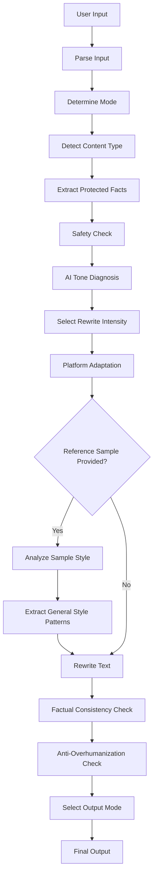

# Workflow Diagram

```mermaid
flowchart TD
    A["User Input"] --> B["Parse Input"]
    B --> C["Determine Mode"]
    C --> D["Detect Content Type"]
    D --> E["Extract Protected Facts"]
    E --> F["Safety Check"]
    F --> G["AI Tone Diagnosis"]
    G --> H["Select Rewrite Intensity"]
    H --> I["Platform Adaptation"]
    I --> J{"Reference Sample Provided?"}
    J -- Yes --> K["Analyze Sample Style"]
    K --> L["Extract General Style Patterns"]
    L --> M["Rewrite Text"]
    J -- No --> M
    M --> N["Factual Consistency Check"]
    N --> O["Anti-Overhumanization Check"]
    O --> P["Select Output Mode"]
    P --> Q["Final Output"]
```

